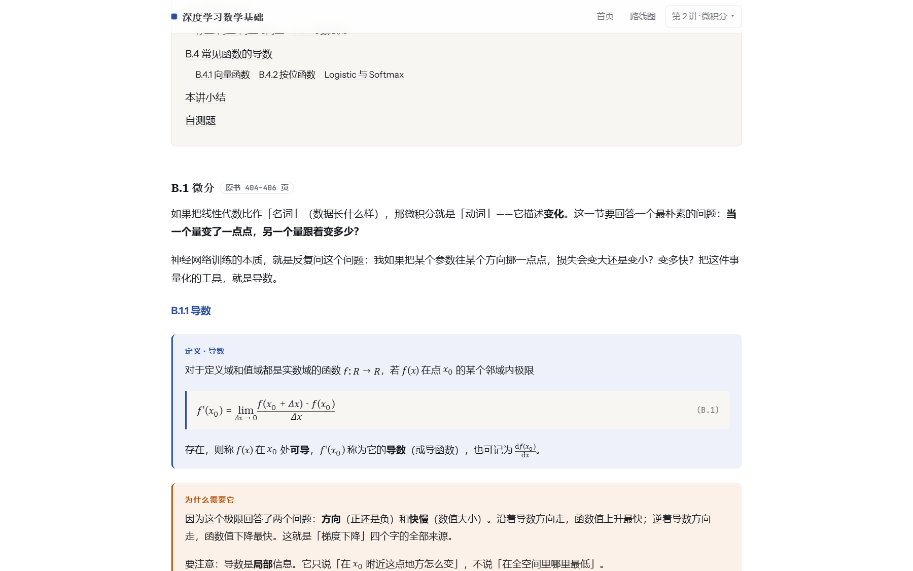

<div align="center">

# 研一课程学习站

**深度学习数学基础讲义（5 讲）· 研一课程大纲总览（7 门）**

纯静态 · 零依赖 · 完全离线可用

[](https://seven-gan.github.io/course-notes/)
[](https://seven-gan.github.io/course-notes/)
[](#技术说明)
[](#技术说明)
[](#内容来源与许可)

### [**🌐 立即访问 →**](https://seven-gan.github.io/course-notes/)

</div>

---

## 📸 预览

<div align="center">

**首页 · 两个入口**

[](https://seven-gan.github.io/course-notes/)

**课程大纲总览 · 搜索 / 筛选 / 学时分布**

[](https://seven-gan.github.io/course-notes/course-hub.html#/courses)

**讲义正文 · 原生 MathML 公式排版**

[](https://seven-gan.github.io/course-notes/nndl-math-notes/lesson-02-calculus.html)

</div>

---

## ✨ 两部分内容

<table>
<tr>
<th width="50%">📘 深度学习数学基础讲义</th>
<th width="50%">🗂 研一课程大纲总览</th>
</tr>
<tr valign="top">
<td>

5 讲讲义，对应邱锡鹏《神经网络与深度学习》数学基础附录 A–E：

| 讲 | 主题 | 原书页 |
|:--:|---|---|
| 1 | 线性代数 | 395–403 |
| 2 | 微积分 | 404–412 |
| 3 | 数学优化 | 413–419 |
| 4 | 概率论 | 420–432 |
| 5 | 信息论 | 433–438 |

每讲固定结构：**定义 → 为什么需要它 → 深度学习中的落点**，
并配带完整解答的自测题。

</td>
<td>

7 门课，从教学目的到逐章逐节大纲：

| 课程 | 学时 | 学分 |
|---|:--:|:--:|
| 现代数字信号处理 | 40 | 2 |
| 海洋声学 | 50 | 2.5 |
| 机器人机构学 | 40 | 2 |
| 智能传感与信息处理 | 40 | 2 |
| **机器人学** ⭐ | 60 | 3 |
| 无人系统自主决策与优化 | 40 | 2 |
| **模式识别** ⭐ | 36 | 3 |

⭐ 学科核心课

含课程编码、属性、教师、预修课、章节学时分布、教师简介。

</td>
</tr>
</table>

---

## 🚀 两个版本，按需取用

| | [**完整版**](https://seven-gan.github.io/course-notes/course-hub.html) | [**讲义版**](https://seven-gan.github.io/course-notes/nndl-math-notes/) |
|---|---|---|
| **内容** | 课程总览 + 5 讲讲义 | 5 讲讲义 + 学习路线图 |
| **形态** | 单文件（字体内嵌） | 多文件（资源分离） |
| **首次加载** | 约 2 MB | 更轻，之后走浏览器缓存 |
| **适合** | 一站式浏览、离线保存 | 长时间阅读、逐讲翻阅 |

> 两个版本的**讲义内容完全一致**；完整版多出课程大纲总览。

### 功能一览

- 🔍 **全文搜索** —— 按课程名 / 英文名 / 课程编码 / 教师 / 章节关键词匹配
- 🏷️ **按属性筛选** —— 学科核心课 / 专业课一键过滤
- 📊 **学时分布可视化** —— 每章按学时比例显示进度条
- 📐 **1583 个公式** —— 浏览器原生 MathML 排版，无需 KaTeX / MathJax
- ✅ **70 道自测题** —— 每题带「提示」与「查看解答」两级折叠
- 🌗 **深浅主题切换** —— 课程总览可切换配色
- 📴 **完全离线** —— 无 CDN、无外链、无网络请求，双击即可阅读

---

## 📁 目录结构

```
course-notes/
├── index.html                    落地页：两个入口
├── course-hub.html               完整版（课程总览 + 5 讲，字体内嵌，单文件）
├── nndl-math-notes/              讲义版
│   ├── index.html                讲义首页（课程卡片）
│   ├── nndl-math-notes.html      学习路线图
│   ├── lesson-01-linear-algebra.html
│   ├── lesson-02-calculus.html
│   ├── lesson-03-optimization.html
│   ├── lesson-04-probability.html
│   ├── lesson-05-information-theory.html
│   └── _shared/                  样式 / 脚本 / 9 个本地字体
├── docs/preview/                 README 预览截图
├── .nojekyll                     ★ 不可删除，见下
└── README.md
```

---

## ⚠️ 关于 `.nojekyll`

**这个文件不能删。**

GitHub Pages 默认用 Jekyll 处理站点，而 Jekyll 会**忽略以 `_` 开头的目录**。
`nndl-math-notes/_shared/` 一旦被忽略，讲义版的样式与字体会全部失效，
页面会退化成没有排版的纯文本。

`.nojekyll` 让 Pages 跳过 Jekyll，直接按原样发布。

---

## 🛠 技术说明

- **无构建步骤** —— 纯 HTML + CSS + 原生 JS，克隆下来直接打开就能用
- **无第三方库** —— 公式用浏览器原生 MathML，插图是手写内联 SVG
- **字体已本地化** —— IBM Plex Serif / Instrument Sans / JetBrains Mono；
  完整版内嵌为 base64，讲义版作为独立文件以便浏览器缓存
- **离线优先** —— 不依赖任何网络资源，断网也能完整阅读

---

## 📄 内容来源与许可

- **讲义**：基于邱锡鹏《神经网络与深度学习》（2019-11-21 版）数学基础附录 A–E
  的**原创讲解与重排**，公式编号与页码与原书一致，便于对照查证。
  属学习笔记范畴，**不复制原书正文**。
- **课程大纲**：摘自中国科学院大学本学期公开的课程教学大纲（教学目的、章节、
  学时、教师姓名）。版权归原课程与原作者，转载或二次使用请自行确认合规性。
- 本站为**个人学习笔记**，非官方发布。

---

<div align="center">

**如果这份资料对你有帮助，欢迎点个 ⭐ Star**

[在线访问](https://seven-gan.github.io/course-notes/) ·
[完整版](https://seven-gan.github.io/course-notes/course-hub.html) ·
[讲义版](https://seven-gan.github.io/course-notes/nndl-math-notes/) ·
[问题反馈](https://github.com/seven-gan/course-notes/issues)

</div>
